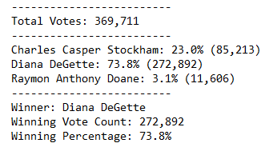

# Election Analysis

## Overview of Election Audit:

Preform audit of the election data to verify results for the Colorado Board of Elections. Develop code that can be reused across other local, congressional, and senatorial districts. 

## Election Audit Results:

 - How many votes were cast in this congressional election? 
   369,711
   
 - Provide a breakdown of the number of votes and the percentage of total votes for each county in the precinct.
   Jefferson: 10.5% (38,855)
   Denver: 82.8% (306,055)
   Arapahoe: 6.7% (24,801)
   
 - Which county had the largest number of votes?
   Denver
   
 - Provide a breakdown of the number of votes and the percentage of the total votes each candidate received.
   Charles Casper Stockham: 23.0% (85,213)
   Diana DeGette: 73.8% (272,892)
   Raymon Anthony Doane: 3.1% (11,606)
   
 - Which candidate won the election, what was their vote count, and what was their percentage of the total votes?
   Winner: Diana DeGette
   Winning Vote Count: 272,892
   Winning Percentage: 73.8%

## Resources

Data Source: election_results.csv

Software: Python 3.6.1, Visual Studio Code 1.70.2

## Audit Summary 

Note: This is the automated summary output from PyPoll.py

## Challenge Overview

## Challenge Overview
